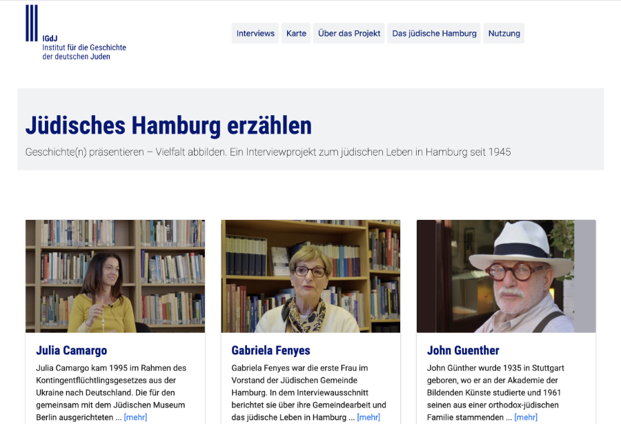

# Jüdisches Hamburg erzählen

Software for the oral history portal ["Jüdisches Hamburg erzählen"(Telling Jewish Hamburg)](https://juedisches-hamburg-erzaehlen.de) build for the [Institute for the History of the German Jews](https://www.igdj-hh.de).

Published on January 27th 2023.

[https://juedisches-hamburg-erzaehlen.de](https://juedisches-hamburg-erzaehlen.de)

## Documentation

### Used frameworks

- [Symfony 5.4 LTS](https://symfony.com/releases/5.4)
- [Bootstrap 4.4.1](https://github.com/twbs/bootstrap/releases/tag/v4.4.1)
- [Lightbox by Lokesh Dhakar](https://lokeshdhakar.com/projects/lightbox2)

### Used symfony packages

- [Annotation routes](https://symfony.com/doc/current/page_creation.html#annotation-routes) for routing; `composer require annotations`
- [Symfony recipes](https://github.com/symfony/recipes) `composer recipes`
- [Template engine Twig](https://twig.symfony.com) `composer require template`
- [Asset component](https://symfony.com/doc/current/components/asset.html) `composer require symfony/asset`

### Setting up the project

Download this package from github.

`git clone https://github.com/annaneo/interview-portal.git`

Navigate into project folder.

`cd juedisches-hamburg-erzaehlen`

Run composer.

`composer install`

Start server.

`symfony serve -d`

View the project at `http://127.0.0.1:8000` or `http://localhost:8000`

### ⚠️ Project resources

This repository contains the software and the texts of the portal. 
Image and video content is not part of this github-project. 
So no images or videos will be displayed in a local setup. 
Images and videos are to be placed into the folders _juedisches-hamburg-erzaehlen/public/images_ and _juedisches-hamburg-erzaehlen/public/videos_.
